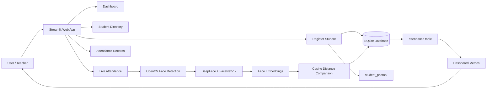
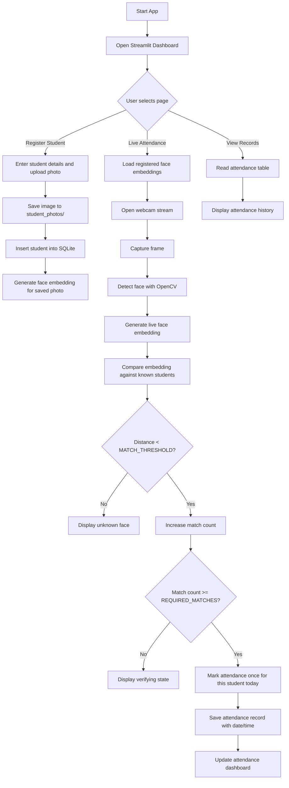

# FaceAttend AI

Face recognition based student attendance system built using Python, OpenCV, DeepFace, and Streamlit.

## Overview

FaceAttend AI is an academic project that automates student attendance using a webcam and face recognition technology. The application allows a teacher or admin to register students, store their photographs, perform live face recognition, and record attendance in a local SQLite database.

Instead of manual attendance marking, the system captures a live video frame, detects the face, extracts a face embedding using DeepFace with the FaceNet512 model, compares it with registered student embeddings, and records attendance only when the match is consistent and stable.

## Objectives

- Automate student attendance using facial recognition
- Reduce manual effort and errors in attendance tracking
- Maintain a digital student directory
- Ensure a student is marked only once per day
- Provide a simple web interface for admin use

## System Architecture

The project follows a simple layered architecture:

1. User Interface Layer: Streamlit web pages for dashboard, registration, directory, live attendance, and records
2. Application Layer: Python logic in `app.py` for database operations, face detection, face embedding generation, and attendance marking
3. AI / Vision Layer: OpenCV face detection and DeepFace FaceNet512 embedding comparison
4. Data Layer: SQLite database storing student and attendance records
5. Storage Layer: Local image files in `student_photos/`



### Architectural Components

#### 1. Streamlit UI
The application is built as a multi-page Streamlit app. It includes:
- Dashboard
- Register Student
- Student Directory
- Live Attendance
- Attendance Records

These pages interact with SQLite and display student details, attendance metrics, and live recognition results.

#### 2. SQLite Database
The project uses SQLite to store:
- Student data (`students` table)
- Attendance data (`attendance` table)

The database prevents duplicate attendance for the same student on the same day using a unique constraint on `(student_id, attendance_date)`.

#### 3. Face Detection and Recognition
The application performs the following recognition pipeline:
- read webcam frame through `streamlit-webrtc`
- detect face using OpenCV Haar Cascade
- crop the detected face
- generate a face embedding with `DeepFace.represent(..., model_name="Facenet512")`
- compare with stored student embeddings using cosine distance
- accept recognition only if the computed distance is below the configured threshold

#### 4. Student Photo Storage
Every registered student photo is saved in the `student_photos/` folder. These stored images are used to generate face embeddings for matching.

## Workflow Diagram



## Main Program Logic

The logic is implemented in `app.py` and is structured around the following key functions and classes:

### Database Layer
- `get_connection()`
- `create_tables()`
- `get_students()`
- `add_student()`
- `update_student()`
- `delete_student()`
- `get_attendance()`
- `mark_attendance()`

These functions handle all database interaction for student records and attendance tracking.

### Face Recognition Layer
- `prepare_face()`
- `get_face_embedding()`
- `cosine_distance()`
- `build_student_embeddings()`
- `refresh_face_embeddings()`
- `FaceAttendanceProcessor`

This layer transforms user-uploaded and live webcam faces into embeddings and compares them using cosine distance.

### Recognition Parameters
The project currently uses:
- `MATCH_THRESHOLD = 0.30`
- `REQUIRED_MATCHES = 5`

This means a face must closely match a stored face and remain consistent across several frames before attendance is marked. This reduces false recognition or random mismatches.

## Pages in the Application

### 1. Dashboard
Shows:
- total number of students
- students present today
- students not yet marked present
- today’s attendance table
- recent student registrations

### 2. Register Student
User enters:
- Student ID / USN
- Full name
- Department
- Email
- Photo

The app validates the fields and saves the image in `student_photos/` before storing the database record.

### 3. Student Directory
Displays all registered students with their details and photographs. It also supports:
- search by name or ID
- edit student details
- delete student records and photo

### 4. Live Attendance
This is the most important module. The webcam stream runs continuously and performs recognition on each frame in batches. When a student is recognized and the confidence is stable, attendance is stored automatically.

### 5. Attendance Records
Displays all recorded attendance entries with the date, time, and status. Users can also download the records as CSV.

## Database Design

### students table
Stores student details:

```text
student_id TEXT PRIMARY KEY
name TEXT NOT NULL
department TEXT
email TEXT
photo_path TEXT NOT NULL
created_at TEXT NOT NULL
```

### attendance table
Stores attendance logs:

```text
id INTEGER PRIMARY KEY AUTOINCREMENT
student_id TEXT NOT NULL
attendance_date TEXT NOT NULL
attendance_time TEXT NOT NULL
status TEXT NOT NULL DEFAULT 'Present'
UNIQUE(student_id, attendance_date)
```

The uniqueness rule ensures that each student can only be marked once per day.

## Technologies Used

- Python
- Streamlit
- OpenCV
- DeepFace
- FaceNet512
- TensorFlow
- streamlit-webrtc
- SQLite
- Pandas
- NumPy
- Pillow

## Project Structure

```text
FaceAttendAI/
├── app.py                  # Main Streamlit application
├── requirements.txt        # Python dependencies
├── attendance.db          # SQLite database
├── student_photos/         # Registered face images
├── README.md              # Project documentation
├── .gitignore             # Ignored local files
├── .python-version        # Python version file
└── .venv/                 # Local virtual environment (optional)
```

## Installation

### 1. Clone the repository

```bash
git clone https://github.com/TeliMushera/FaceAttendAI.git
cd FaceAttendAI
```

### 2. Create a virtual environment

```bash
python -m venv .venv
```

Activate it:

#### Windows
```bash
.venv\Scripts\activate
```

### 3. Install dependencies

```bash
python -m pip install -r requirements.txt
```

## Running the Application

```bash
python -m streamlit run app.py
```

Then open the URL displayed in the terminal, usually:

```text
http://localhost:8501
```

## How to Use the Application

### Step 1: Register students
Go to the Student Registration page and enter:
- Student ID
- Name
- Department
- Email
- Student photo

### Step 2: Check student directory
Use the Student Directory page to verify the registration and search for a student if needed.

### Step 3: Start live attendance
Open the Live Attendance page and allow webcam access. The system will detect a face and try to match it with registered faces.

### Step 4: Review attendance
Open the Attendance Records page to view marks and download attendance as CSV.

## Important Notes

- A clear and front-facing image gives better recognition accuracy.
- Good lighting improves detection reliability.
- The app works best when only one face is visible in the frame at a time.
- This version stores data locally and is aimed at academic/demo use.
- Student biometric photos should be handled responsibly and only with proper permission.

## Future Enhancements

Possible improvements include:
- admin login system
- cloud database integration
- better face recognition models
- attendance report export in Excel/PDF
- secure authentication
- multi-camera support
- deployment to a web server or cloud platform

## Academic Use

This project demonstrates how deep learning, computer vision, and web development can be combined in a practical real-world application. It is suitable for academic demonstration, lab projects, and learning-based attendance automation systems.

## Author

Teli Mushera

B.E. in Information Science & Engineering
Dayananda Sagar College of Engineering, Bengaluru

## License

This project is intended for educational and academic use.